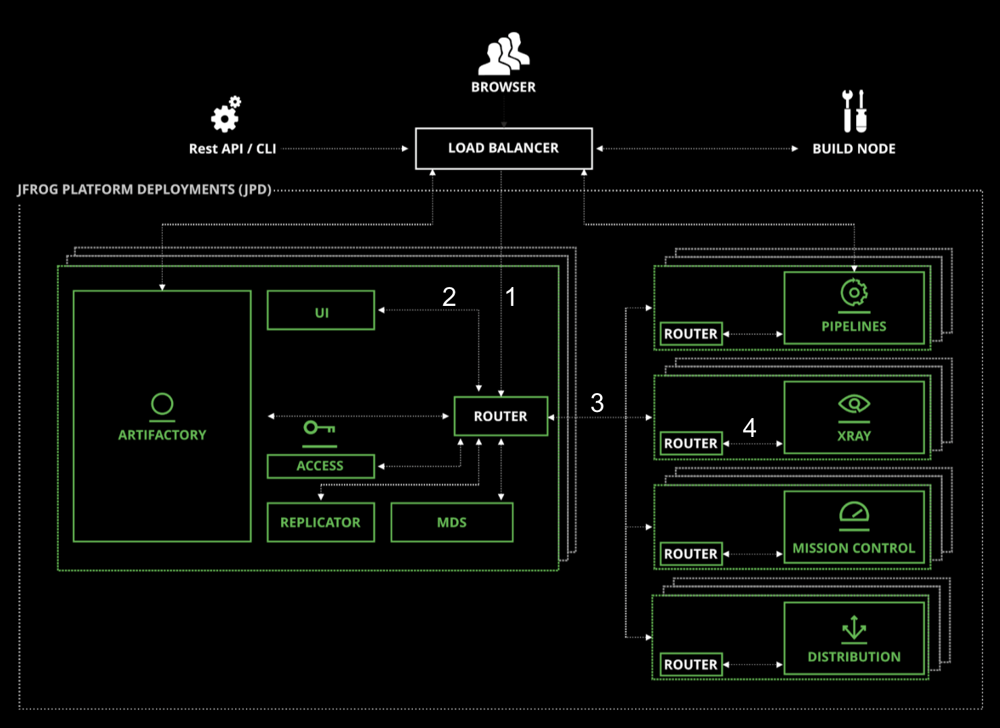

<br/>

Tracing provides the data to understand the lifecycle of a request or action in a distributed system.

**Personas**: system administrators and developers

<br/>

#### Trace ID

A trace is a way of representing a series of related events across a distributed system, particularly important in a microservice oriented environment.

JFrog enables this via `trace ID`.



<br/>

1. Tail a log file
  ```execute
  clear
  tail -f var/log/artifactory-request.log
  ```


2. Copy the TRACE_ID from a log file entry and search for it
  ```copy-and-edit
  grep var/log/*.* -e TRACE_ID
  ```

<br/>


#### Artifactory Tracing

- `?trace`  
  - Repository Resolution
  - Remote-cache utilization
  - User plugin invocation

  Example:
  `https://<jfrog-url>/artifactory/dev-generic-local/dev-training/myfile.jar?trace`

<br/>  

  Upload a file:    
  ```execute-2
    curl -H "Authorization: Bearer $JFROG_ACCESSTOKEN" -X PUT "$JFROG_PROTOCOL://$JFROG_URL/artifactory/example-repo-local/dev-training/find-largest-files.aql" -T files/find-largest-files.aql
  ```

  Access file with `?trace` parameter:    
  ```execute-2
    curl -H "Authorization: Bearer $JFROG_ACCESSTOKEN" -X GET "$JFROG_PROTOCOL://$JFROG_URL/artifactory/example-repo-local/dev-training/find-largest-files.aql?trace"
  ```

<br/>

  Example of output:
  ```
    Request ID: 1aa7ef93
    Repo Path ID: dev-generic-local:dev-training/jfrog_automation_narasimha.mp4
    Method Name: GET
    User: admin
    Time: 2021-06-24T23:19:44.876Z
    Thread: http-nio-8081-exec-3
    Steps: 
    2021-06-24T23:19:44.876Z Received request
    2021-06-24T23:19:44.880Z Request source = 10.36.3.1, Last modified = 31-12-69 23:59:59 +00:00, If modified since = -1, Thread name = http-nio-8081-exec-3
    2021-06-24T23:19:44.882Z Executing any BeforeDownloadRequest user plugins that may exist
    2021-06-24T23:19:44.884Z Retrieving info from local repository 'dev-generic-local' type Generic
    2021-06-24T23:19:44.914Z Requested resource is found = true
    2021-06-24T23:19:44.914Z Requested resource is blocked = false
    2021-06-24T23:19:44.914Z Request is HEAD = false
    2021-06-24T23:19:44.914Z Request is for a checksum = false
    2021-06-24T23:19:44.914Z Target repository is not remote or doesn't store locally = true
    2021-06-24T23:19:44.915Z Requested resource was not modified = false
    2021-06-24T23:19:44.915Z Responding with found resource
    2021-06-24T23:19:44.915Z Executing any AltAllResponses user plugins that may exist
    2021-06-24T23:19:44.916Z Alternative response status is set to 0 and message to 'null'
    2021-06-24T23:19:44.916Z Found no alternative content handles
    2021-06-24T23:19:44.916Z Executing any AltResponse user plugins that may exist
    2021-06-24T23:19:44.917Z Alternative response status is set to -1 and message to 'null'
    2021-06-24T23:19:44.917Z Found no alternative content handles
    2021-06-24T23:19:44.917Z Retrieving a content handle from target repo
    2021-06-24T23:19:44.918Z The requested resource isn't pre-resolved
    2021-06-24T23:19:44.919Z Target repository isn't virtual - verifying that downloading is allowed
    2021-06-24T23:19:44.919Z Creating a resource handle from 'dev-generic-local:dev-training/jfrog_automation_narasimha.mp4'
    2021-06-24T23:19:44.920Z Identified requested resource as a file
    2021-06-24T23:19:44.920Z Requested resource is an ordinary artifact - using normal content handle with length '90263627'
    2021-06-24T23:19:44.940Z Executing any BeforeDownload user plugins that may exist
    2021-06-24T23:19:44.941Z Responding with selected content handle
    2021-06-24T23:19:44.951Z Request succeeded  
  ```

<br/>  


  Delete file:    
  ```execute-2
    curl -H "Authorization: Bearer $JFROG_ACCESSTOKEN" -X DELETE "$JFROG_PROTOCOL://$JFROG_URL/artifactory/example-repo-local/dev-training/find-largest-files.aql"
  ```

<br/>  

---

